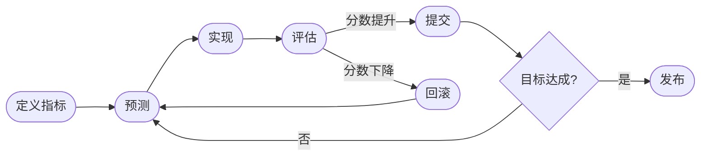

# Learn AutoResearch

<p align="center">
  <strong>定义指标，设定目标，让 Agent 彻夜迭代。</strong><br/>
  基于项目的自动化研究循环课程——灵感来自 Karpathy 自主 ML 训练循环。
</p>

<p align="center">
  
</p>

<p align="center">
  
</p>

<p align="center">
  
  
  
  
  
</p>

<p align="center">
  <a href="README_EN.md">English →</a> &nbsp;|&nbsp;
  <a href="https://AI4Scientist.github.io/learn-auto-research/">在线文档 →</a>
</p>

---

## 这是什么？

**Learn AutoResearch** 教你自动化研究循环：定义可测量的指标，让 Agent 生成假设、实现改变、评估结果、提交改进——然后彻夜重复。

核心理念来自 Andrej Karpathy 的 [AutoResearch](https://github.com/karpathy/autoresearch)。本课程将其泛化到任何可以写出 `{"pass": bool, "score": float}` 的领域。

---

## 循环是如何运作的



每次迭代：一个假设，一个改变，一次测量。Git 记录每次实验。你醒来看到按分数排列的结果表。

---

## 你将学到什么

| # | 技能 | 如何练习 |
|---|------|---------|
| 1 | **可测量目标** | 把"让它更快"变成 `median_time_s < 0.5` |
| 2 | **自主改进循环** | 每次迭代一个改变，自动回滚 |
| 3 | **科学调试** | 可证伪假设，基于证据的调查 |
| 4 | **行动前预判** | 提交任何重大改变前的 5 专家视角 |
| 5 | **安全审计** | STRIDE + OWASP + 红队分析，带代码级证据 |
| 6 | **发布** | 8 阶段流水线：代码 → 内容 → 部署 |

---

## 课程结构

| 阶段 | 讲义 | 项目 | 目标 |
|------|------|------|------|
| **1 — 理解原理** | L01 为什么手动迭代失败 · L02 可测量目标 | P01 排序优化 | `median_time_s < 0.5` |
| **2 — 核心循环** | L03 五阶段循环 · L04 遇到瓶颈时 | P02 函数拟合 | `rmse < 0.05` |
| **3 — 调试修复** | L05 科学调试 · L06 错误归零流水线 | P03 FastAPI 调试 | `test_pass_rate == 1.0` |
| **4 — 多视角预测** | L07 五专家预判 · L08 对抗性精化 | P04 架构辩论 | `weighted_score ≥ 0.65` |
| **5 — 安全场景** | L09 STRIDE+OWASP 审计 · L10 12 维场景探索 | P05 安全审计 | `security_score == 1.0` |
| **6 — 发布高级** | L11 通用发布流水线 · L12 过夜运行 | P06 端到端流水线 | `rouge1_recall ≥ 0.60` |

---

## 项目代码

每个项目都附带可运行的起始代码和参考答案：

```
projects/
├── project-01/   排序优化
├── project-02/   函数拟合
├── project-03/   FastAPI 调试
├── project-04/   架构辩论
├── project-05/   安全审计
└── project-06/   端到端流水线
```

每个 `starter/evaluate.py` 遵循统一协议：

```python
print(json.dumps({"pass": bool, "score": float}))
```

---

## 快速开始

```bash
# 安装依赖
npm install

# 启动本地预览
npm run dev

# 构建静态站点
npm run build
```

---

## 技术栈

| 层级 | 工具 |
|------|------|
| 站点生成器 | [VitePress](https://vitepress.dev/) 1.6+ |
| 流程图 | [vitepress-plugin-mermaid](https://github.com/emersonbottero/vitepress-plugin-mermaid) |
| 语言 | 中文（默认）+ 英文（`/en/`） |
| 项目代码 | Python 3.10+，仅标准库，无需 pip |

---

## 引用

```bibtex
@software{learn_autoresearch2026,
  title  = {Learn AutoResearch: A Project-Based Course on Autonomous Research Loops},
  author = {Zhao, Zhimin},
  year   = {2026},
  url    = {https://github.com/AI4Scientist/learn-auto-research}
}
```

## 许可证

MIT
