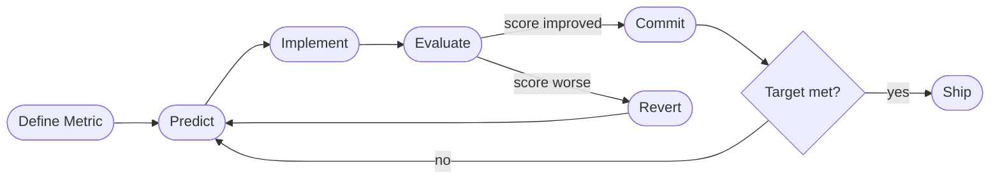

# Learn AutoResearch

<p align="center">
  <strong>Define a metric. Set a target. Let the agent iterate overnight.</strong><br/>
  A project-based course on autonomous research loops — inspired by Karpathy's self-improving ML training loop.
</p>

<p align="center">
  
</p>

<p align="center">
  
</p>

<p align="center">
  
  
  
  
  
</p>

<p align="center">
  <a href="README.md">中文版 →</a> &nbsp;|&nbsp;
  <a href="https://AI4Scientist.github.io/learn-auto-research/">Live Docs →</a>
</p>

---

## What Is This?

**Learn AutoResearch** teaches you to automate the research loop: define a measurable metric, let an agent generate hypotheses, implement changes, evaluate results, and commit improvements — then repeat overnight.

The core idea comes from [Andrej Karpathy's autoresearch](https://github.com/karpathy/autoresearch). This course generalizes it beyond ML to any domain where you can write `{"pass": bool, "score": float}`.

---

## How the Loop Works



Each iteration: one hypothesis, one change, one measurement. Git records every experiment. You wake up to a ranked table of what worked.

---

## What You Will Learn

| # | Skill | How You Practice It |
|---|-------|---------------------|
| 1 | **Measurable goals** | Turn "make it faster" into `median_time_s < 0.5` |
| 2 | **Autonomous loops** | One change per iteration, automatic rollback |
| 3 | **Scientific debugging** | Falsifiable hypotheses, evidence-based investigation |
| 4 | **Predict before acting** | 5-expert perspectives before any major change |
| 5 | **Security auditing** | STRIDE + OWASP + red-team with code-level evidence |
| 6 | **Shipping** | 8-phase pipeline: code → content → deployment |

---

## Curriculum

| Phase | Lectures | Project | Goal |
|-------|----------|---------|------|
| **1 — Foundations** | L01 Why manual iteration fails · L02 Measurable goals | P01 Sort optimization | `median_time_s < 0.5` |
| **2 — Core Loop** | L03 Five-stage internals · L04 When stuck | P02 Function fitting | `rmse < 0.05` |
| **3 — Debug & Fix** | L05 Scientific debugging · L06 Error-crushing pipeline | P03 FastAPI debugging | `test_pass_rate == 1.0` |
| **4 — Predict & Reason** | L07 Five-expert prediction · L08 Adversarial refinement | P04 Architecture debate | `weighted_score ≥ 0.65` |
| **5 — Security & Scenarios** | L09 STRIDE+OWASP audit · L10 12-dimension exploration | P05 Security audit | `security_score == 1.0` |
| **6 — Ship & Advanced** | L11 Universal ship pipeline · L12 Overnight runs | P06 End-to-end pipeline | `rouge1_recall ≥ 0.60` |

---

## Project Code

Every project ships with a runnable starter and reference solution:

```
projects/
├── project-01/   sort optimization
├── project-02/   function fitting
├── project-03/   FastAPI debugging
├── project-04/   architecture debate
├── project-05/   security audit
└── project-06/   end-to-end pipeline
```

Each `starter/evaluate.py` follows the contract:

```python
print(json.dumps({"pass": bool, "score": float}))
```

---

## Quick Start

```bash
# Install dependencies
npm install

# Start local dev server
npm run dev

# Build static site
npm run build
```

---

## Tech Stack

| Layer | Tool |
|-------|------|
| Site generator | [VitePress](https://vitepress.dev/) 1.6+ |
| Diagrams | [vitepress-plugin-mermaid](https://github.com/emersonbottero/vitepress-plugin-mermaid) |
| Languages | English (root) + Chinese (`/zh/`) |
| Project code | Python 3.10+, stdlib only — no pip required |

---

## Citation

```bibtex
@software{learn_autoresearch2026,
  title  = {Learn AutoResearch: A Project-Based Course on Autonomous Research Loops},
  author = {Zhao, Zhimin},
  year   = {2026},
  url    = {https://github.com/AI4Scientist/learn-auto-research}
}
```

## License

MIT
