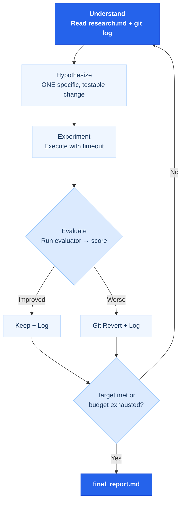

# Welcome to Learn AutoResearch

[中文版本 →](/zh/)

Learn AutoResearch is a project-based course on automating research using the autoresearch framework — a generalization of Karpathy's autonomous ML training loop to any domain with a measurable metric.

> *"Set the GOAL → The agent runs the LOOP → You wake up to results."*

## What you will learn

<ul class="index-list">
  <li><strong>Define measurable research goals</strong> — turn vague objectives into mechanical metrics any agent can optimize.</li>
  <li><strong>Run autonomous improvement loops</strong> — one change per iteration, automatic rollback, git as memory.</li>
  <li><strong>Debug scientifically</strong> — falsifiable hypotheses, evidence-based investigation, zero-error termination.</li>
  <li><strong>Predict before acting</strong> — five expert perspectives before committing to any major change.</li>
  <li><strong>Audit security autonomously</strong> — STRIDE + OWASP + red-team analysis with code-level evidence.</li>
  <li><strong>Ship with confidence</strong> — 8-phase pipeline covering code, content, and deployments.</li>
</ul>

## Get started

  <a href="./lectures/lecture-01-why-manual-iteration-fails/" class="card">
    <h3>Lectures</h3>
    
12 lectures from first principles (why manual iteration fails) to advanced overnight runs and CI/CD integration.

  </a>
  <a href="./projects/" class="card">
    <h3>Projects</h3>
    
Six hands-on projects — each with a starter codebase and a reference solution, building to a full end-to-end pipeline.

  </a>
  <a href="./resources/" class="card">
    <h3>Resource Library</h3>
    
Copy-ready templates: research.md, evaluate.py, results.tsv, and metric cheat sheets for 15 domains.

  </a>

## The Core Loop

Every autoresearch command is built on the same five-stage loop:

## Course Structure

The course is organized into **6 phases**, each containing 2 lectures and 1 hands-on project:

| Phase | Theme | Lectures | Project |
|-------|-------|---------|---------|
| 1 | Why AutoResearch Works | L01–L02 | Sort optimization |
| 2 | Master the Core Loop | L03–L04 | Function fitting |
| 3 | Debug & Fix | L05–L06 | FastAPI debugging |
| 4 | Predict & Reason | L07–L08 | Architecture debate |
| 5 | Security & Scenarios | L09–L10 | Security audit pipeline |
| 6 | Ship & Advanced Patterns | L11–L12 | End-to-end research |

## Next steps

<ul class="index-list">
  <li><a href="./lectures/lecture-01-why-manual-iteration-fails/">Lecture 01: Why Manual Iteration Fails</a> — Start with Karpathy's original insight.</li>
  <li><a href="./projects/project-01-first-research-loop/">Project 01: Your First Research Loop</a> — Run the sort optimization example hands-on.</li>
  <li><a href="./resources/templates/">Templates</a> — Grab the research.md and evaluate.py templates for your own projects.</li>
</ul>
