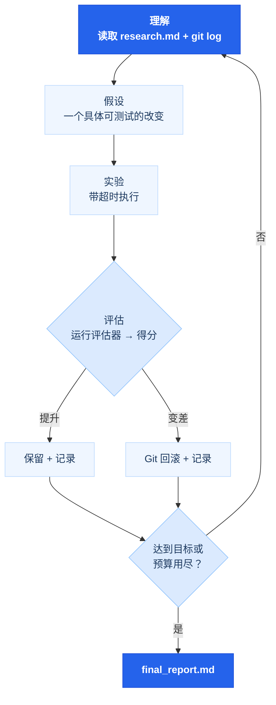

# 欢迎来到 Learn AutoResearch

Learn AutoResearch 是一门基于项目的课程，教你用 autoresearch 框架实现研究自动化——它是 Karpathy 自主 ML 训练循环的泛化版本，适用于任何有可测量指标的领域。

> *"设定目标 → Agent 运行循环 → 你醒来看结果"*

## 你将学到什么

<ul class="index-list">
  <li><strong>定义可测量的研究目标</strong> — 把模糊的目标转化为 agent 能自动优化的机械指标。</li>
  <li><strong>运行自主改进循环</strong> — 每次迭代只做一个改变，自动回滚，git 作为实验记忆。</li>
  <li><strong>科学调试</strong> — 可证伪的假设，基于证据的调查，错误归零自动停止。</li>
  <li><strong>行动前预判</strong> — 5 位专家视角在提交任何重大改变前进行分析。</li>
  <li><strong>自主安全审计</strong> — STRIDE + OWASP + 红队分析，带代码级证据。</li>
  <li><strong>自信地发布</strong> — 覆盖代码、内容、部署的 8 阶段发布流水线。</li>
</ul>

## 开始学习

  <a href="./lectures/lecture-01-why-manual-iteration-fails/" class="card">
    <h3>讲义</h3>
    
12 讲，从第一原理（为什么手动迭代会失败）到高级的过夜运行和 CI/CD 集成。

  </a>
  <a href="./projects/" class="card">
    <h3>项目</h3>
    
六个动手项目，每个都有起始代码和参考答案，逐步构建到完整的端到端流水线。

  </a>
  <a href="./resources/" class="card">
    <h3>资料库</h3>
    
即拿即用的模板：research.md、evaluate.py、results.tsv，以及 15 个领域的指标速查表。

  </a>

## 核心循环

每个 autoresearch 命令都建立在相同的五阶段循环上：

## 课程结构

课程分为 **6 个阶段**，每阶段包含 2 讲和 1 个动手项目：

| 阶段 | 主题 | 讲次 | 项目 |
|------|------|------|------|
| 1 | 理解原理 | L01–L02 | 排序优化 |
| 2 | 掌握核心循环 | L03–L04 | 函数拟合 |
| 3 | 调试与修复 | L05–L06 | FastAPI 调试 |
| 4 | 多视角与预测 | L07–L08 | 架构辩论 |
| 5 | 安全与场景探索 | L09–L10 | 安全审计流水线 |
| 6 | 发布与高级模式 | L11–L12 | 端到端研究 |

## 下一步

<ul class="index-list">
  <li><a href="./lectures/lecture-01-why-manual-iteration-fails/">第一讲：为什么手动迭代会失败</a> — 从 Karpathy 的原始洞见开始。</li>
  <li><a href="./projects/project-01-first-research-loop/">项目一：你的第一个研究循环</a> — 亲手运行排序优化案例。</li>
  <li><a href="./resources/templates/">模板</a> — 获取可在你自己项目中使用的 research.md 和 evaluate.py 模板。</li>
</ul>
